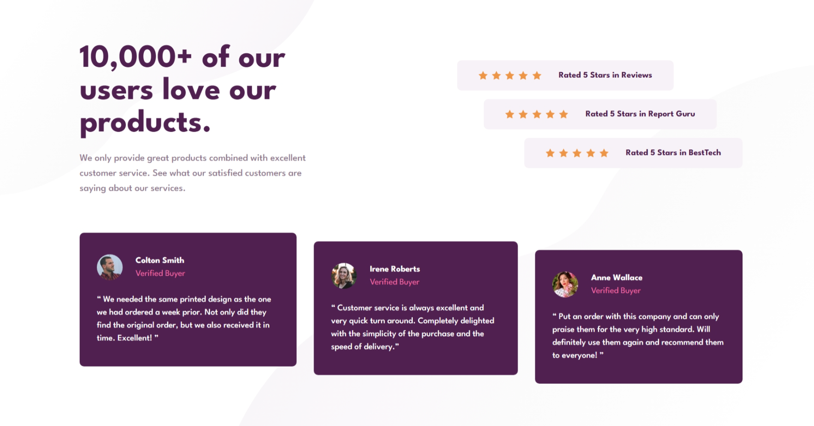

# Frontend Mentor - Social Proof Section Solution

This is my solution to the [Social proof section challenge on Frontend Mentor](https://www.frontendmentor.io/challenges/social-proof-section-6e0qTv_bA). It's a responsive layout that showcases reviews and ratings for a fictional product, built to strengthen my frontend skills using Tailwind CSS.

## Table of Contents

- [Frontend Mentor - Social Proof Section Solution](#frontend-mentor---social-proof-section-solution)
  - [Table of Contents](#table-of-contents)
  - [Overview](#overview)
    - [The Challenge](#the-challenge)
    - [Screenshot](#screenshot)
    - [Links](#links)
  - [My Process](#my-process)
    - [Built With](#built-with)
    - [What I Learned](#what-i-learned)
    - [Useful Resources](#useful-resources)
  - [Author](#author)

## Overview

### The Challenge

Users should be able to:

- View the layout optimized for different screen sizes
- See a responsive grid system using reviews and ratings

### Screenshot



### Links

- 🔗 [Solution on Frontend Mentor](https://www.frontendmentor.io/solutions/social-proof-section-tailwindcss)
- 🌐 [Live Site](https://fawaziwalewa.github.io/social-proof-section)

## My Process

### Built With

- [Tailwind CSS](https://tailwindcss.com/) — utility-first CSS framework
- Semantic HTML5
- CSS Grid & Flexbox
- Mobile-first workflow

### What I Learned

This challenge helped me practice advanced **CSS Grid layout composition** using only Tailwind's utility classes. I also reinforced my understanding of how to avoid excessive spacing in grid items and how to manually position them using `col-start`, `row-start`, `row-span`, and responsive breakpoints.

Here’s a sample of how I positioned elements in the grid without `grid-template-areas`:

```html
<section class="grid grid-cols-2 grid-rows-[auto_auto_auto] gap-4">
  <h1 class="col-start-1 row-start-1">...</h1>
  <p class="col-start-1 row-start-2">...</p>
  <div class="col-start-2 row-span-2">...</div>
</section>
```

### Useful Resources

- [Tailwind CSS Grid Docs](https://tailwindcss.com/docs/grid-template-columns) – Helped me use custom `grid-cols` and `row-span` utilities effectively.
- [Frontend Mentor Community](https://www.frontendmentor.io/community) – Great for inspiration and checking how others approached similar layouts.

## Author

- Website – [iwaola.me](https://iwaola.me)
- Frontend Mentor – [@fawaziwalewa](https://www.frontendmentor.io/profile/fawaziwalewa)
- Twitter – [@IwalewaFawaz](https://twitter.com/IwalewaFawaz)